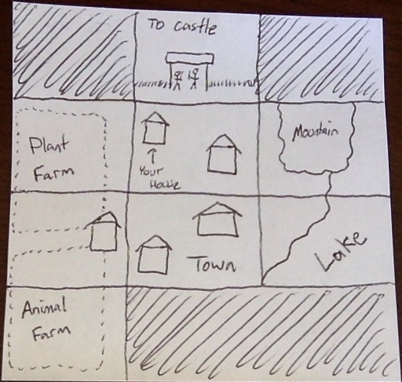

Jugada
======

Jugada is a 2D RPG Adventure.

###To do before we start

 - [ ] Create a simple Story
 - [ ] Define Learning Objectives
 - [ ] Decide on the Technology Stack (Look into [React-Pixi][reactpixi])
 - [ ] Find Graphics
 - [ ] Find [Music][music]/SoundFX

###Story

(thoughts? I'm thinking it'd be kinda [zelda-like][zelda]. Top Down. You have an inventory and can collect things. I'd also like the character to have the ability to change the landscape a bit too. Example: You talk to the farmer. He has you help him plant trees. You can plant them wherever you want (even outside of the plant farm area). As you progress through that quest, the trees start to grow, in the spots you chose.)

Our story starts with a boy named Hubert. He lives in a nice little town. They thrive on their economy of farming, fishing, and mining. Every year they have to give a tribute to the king. This year, Hubert is old enough to help out in preparing the tribute. You get to control Hubert as he helps his fellow villagers. Play as a messenger boy, fisherman, miner, farmer, and all-around good kid.

###Map

###Learning Objectives

 - (Dallin) Make the game feel seamless (just works over page reload without save/load.)
 - (Gabe) Explore the process of making a game; start to finish
 - (All) Figure out basic game mechanics of:
  - Collision Detection
  - Quest Management
  - Game Engine vs Level/World Editor
  - Animation
  - Dialog
  - Storyline (when you lose control of character)

###Future Ideas

 - Extend the story and world
 - Make it [3D][3d]

###Credits

Built with :heart: by [Justin Permann][justin], [Gabriel Dayley][gabe], and [Dallin Osmun][dallin].

[music]: http://www.incompetech.com/music
[reactpixi]: https://www.github.com/Izzimach/react-pixi
[justin]: https://www.github.com/justinkredible56
[gabe]: https://www.github.com/gmdayley
[dallin]: https://www.github.com/numso
[3d]: http://www.playfuljs.com/realistic-terrain-in-130-lines
[zelda]: http://www.destructoid.com/ul/207202-100-series-retrospective-the-legend-of-zelda/ZeldaZelda3-620x.jpg
